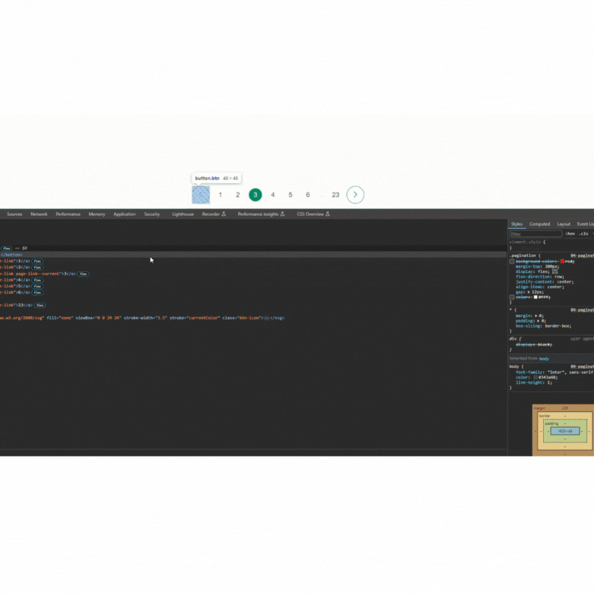
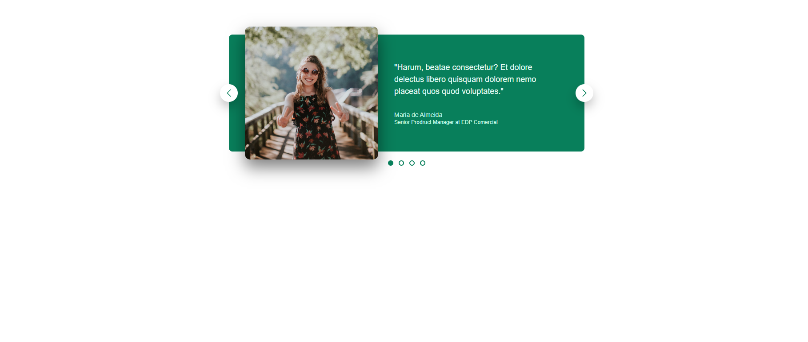
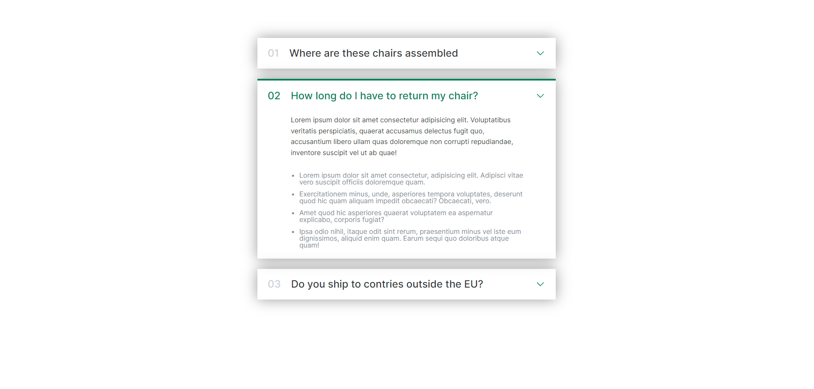

# 01-simpliest-html-css-components-webpage
Portifólio of components for webpages using only HTML and CSS technologies
I only used HTML and CSS and no Javascript.
The main goal of this project was to train Grid and Flexbox layouts, and also responsive design.
### Landing Page

### Chair Shop Webpage

### Paginação

### Carroussel component

### Accordion Component

